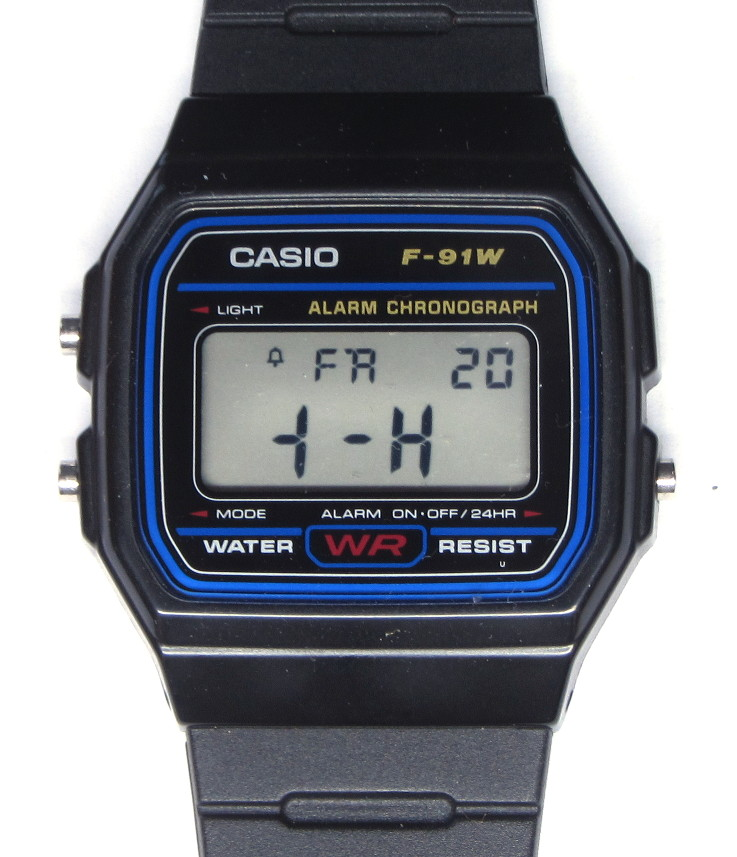
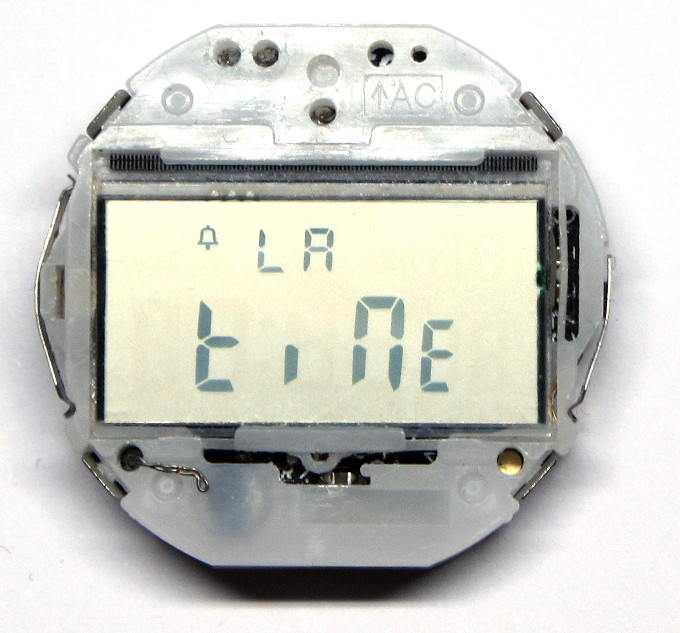
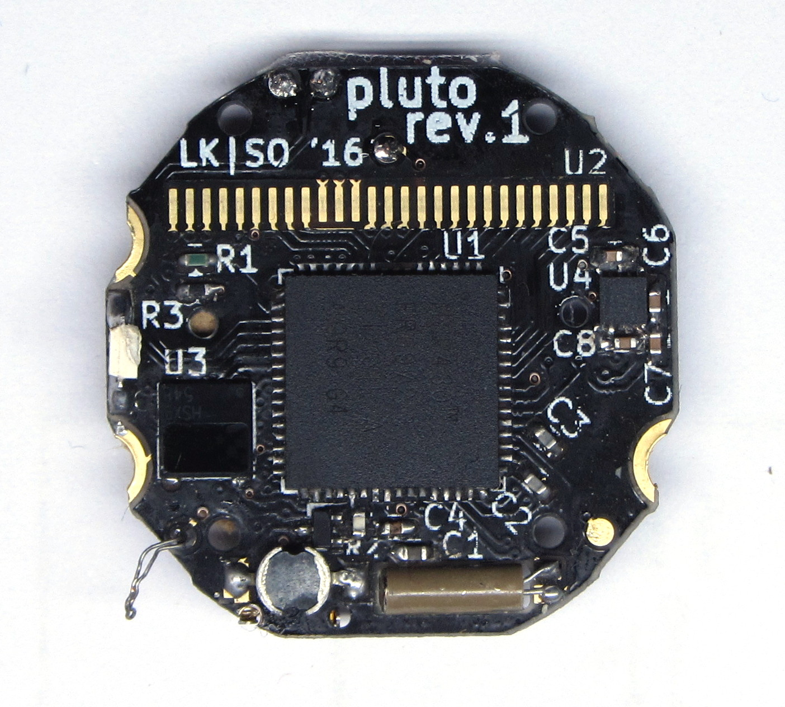
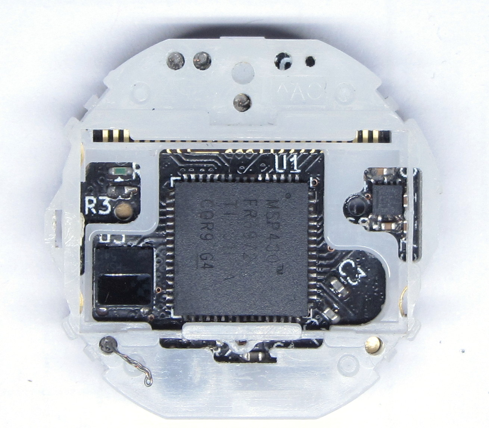
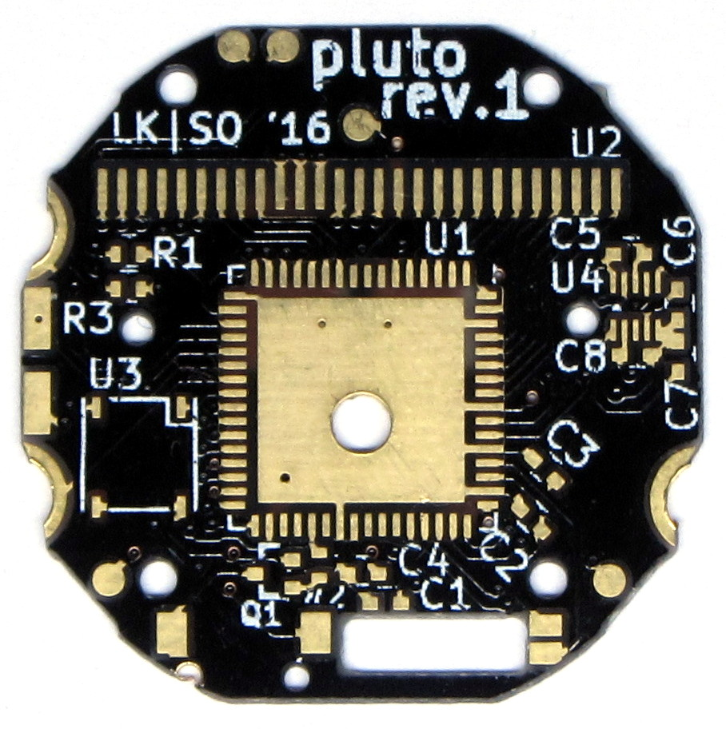

People like photos, so I took some.

#Whole Watch
Pretty boring, looks just like every F-91W, apart from the binary time 
display.  Top vertical segments are hours, bottom vertical segments are 
minutes, horizontal segments are there for locating the bits.

#Frame
The wire sticking out of the bottom left hole is connected to Vcc. It 
has been used to power the watch during firmware development.

#Populated PCB
Despite of the small-sized components (all passives are 0402),
populating the pluto PCB is doable given a microscope and plenty of 
flux. The inductor at the bottom left as been harvested from the 
original PCB. The crystal is wrapped in sticky tape to avoid shorting C1.

#Perfect fit
Like magic, all components fit perfectly within the plastic frame. 
Little space has been wasted.

#Blank PCB
I case you're curios, there it is:

